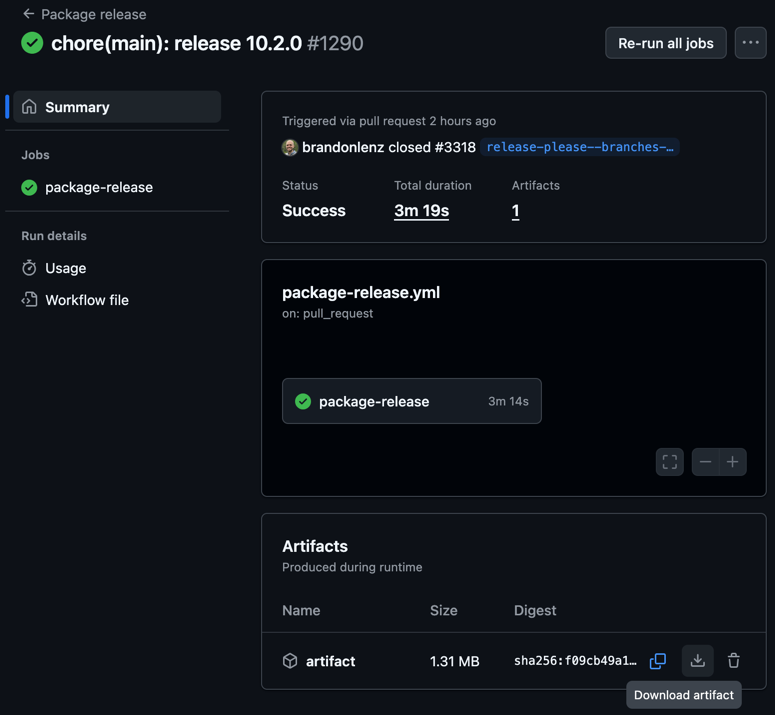

# Releasing React USWDS

To make a version of the React USWDS component library available to consumers, it must be published to [npm](https://www.npmjs.com/package/@trussworks/react-uswds?activeTab=versions).

## Table of Contents

- [Supporting tools](#supporting-tools)
  - [conventional-commits](#conventional-commits)
  - [release-please](#release-please)
  - [github-actions](#github-actions)
  - [npm](#npm)
- [Release and Publish React USWDS](#release-and-publish-react-uswds)
  - [Prerequisites](#prerequisites)
  - [Step-by-step](#step-by-step)
- [Fix a Broken Release](#fix-a-broken-release)

## Supporting tools

A combination of tools work in concert to automate much of the release process.

### [conventional-commits](https://www.conventionalcommits.org/en/v1.0.0/)

Combined with our "squash and merge" preference on Pull Requests, each merged Pull Request results in a singular commit that can be parsed into our [changelog](https://github.com/trussworks/react-uswds/blob/main/CHANGELOG.md).

### [release-please](https://github.com/googleapis/release-please)

Create and manage [release PRs](https://github.com/trussworks/react-uswds/issues?q=is%3Apr%20author%3Aapp%2Fgithub-actions%20label%3A%22type%3A%20release%22) when releasable changes have been merged to `main`, based on our [release-please configuration](https://github.com/trussworks/react-uswds/blob/main/release-please-config.json).

The primary purpose of release PRs is to update the [changelog](https://github.com/trussworks/react-uswds/blob/main/CHANGELOG.md) and increment the version number in [package.json](https://github.com/trussworks/react-uswds/blob/main/package.json).

Merging a release-please release PR will automatically create a [tag](https://github.com/trussworks/react-uswds/tags)/[release](https://github.com/trussworks/react-uswds/releases) in GitHub.

### [github-actions](https://github.com/trussworks/react-uswds/actions)

The following custom actions support the release pipeline:

- [release-please.yml](https://github.com/trussworks/react-uswds/actions/workflows/release-please.yml) enables [release-please](#release-please) as described above.
- [package-release.yml](https://github.com/trussworks/react-uswds/actions/workflows/package-release.yml) packages a clean, publishable build artifact for each release commit.

### [npm](https://www.npmjs.com/package/@trussworks/react-uswds?activeTab=versions)

Publish and host versioned build artifacts for the community to download as a project dependency.

## Release and Publish React USWDS

### Prerequisites

To perform a release, a maintainer must first

- Be part of the [React USWDS Admins team](https://github.com/orgs/trussworks/teams/react-uswds-admins).
- Be an Admin or Owner of the [trussworks npm organization](https://www.npmjs.com/settings/trussworks/members).

Additionally, at least one releasable change must have been merged to main since the previous release.

> [!NOTE]
> If there are no releasable changes as defined by the [release-please configuration](https://github.com/trussworks/react-uswds/blob/main/release-please-config.json), there will be no Release PR to start the release process with.

### Step-by-step

Follow these steps to create and publish a release for a given version, `<major.minor.incremental>`.

1. Review and merge the current [release PR](https://github.com/trussworks/react-uswds/issues?q=is%3Apr%20author%3Aapp%2Fgithub-actions%20label%3A%22type%3A%20release%22).
   - Ensure the branch is up to date with `main`.
   - PR CI checks will likely be stuck in a pending state on the release PR requiring administrator override to merge. This is because GitHub actions in a workflow run cannot trigger new workflow runs. Since `release-please` creates and updates the release PR via a workflow action, PR checks will not run under normal circumstances. We consider this acceptable since release PRs do not change code.
2. Wait for `release-please` to create the corresponding [tag](https://github.com/trussworks/react-uswds/tags) in GitHub including the updates from the changelog.
3. Find and wait for the corresponding [package-release.yml](https://github.com/trussworks/react-uswds/actions/workflows/package-release.yml) action to complete.
4. From the successful package-release workflow run, download the build artifact from the `Artifacts` section of the build summary:
   
5. Get the tarball (`trussworks-react-uswds-v<major.minor.incremental>.tgz`) by unzipping the downloaded `artifact.zip`

   ```shell
   unzip artifact.zip
   ```

   - If, instead of the terminal, you wish to use Archive Utility to unzip `arifact.zip` be aware that Archive Utility defaults to recursively unzipping files, including the `.tgz` itself when unzipping the `artifact.zip`. You will first need to disable the "Keep expanding if possible" setting in your Archive Utility preferences.

6. [Publish](https://docs.npmjs.com/cli/v11/commands/npm-publish) the tarball (`trussworks-react-uswds-v<major.minor.incremental>.tgz`) to npm by running the following command and following the prompts in your terminal.

   ```shell
   npm publish trussworks-react-uswds-v<major.minor.incremental>.tgz
   ```

7. Notify our `#g-uswds` and `#g-uswds-public` Slack channels about the release.

> [!WARNING]
> If any automations are not working for any reason but a release needs to go out before triaging and fixing them, you will have to emulate the corresponding steps manually.
>
> The automations are composed to avoid common "gotchas" so take care at each step to emulate _exactly_ the outputs of previous automation runs.

## Fix a Broken Release

If a release is fundamentally broken for all consumers, the followings steps are recommended to resolve:

1. Triage and fix the issue via the normal bug fix Pull Request process.
2. Publish a new release following the normal [release steps](#release-and-publish-react-uswds).
3. [Deprecate the broken version in npm](https://docs.npmjs.com/deprecating-and-undeprecating-packages-or-package-versions#deprecating-a-single-version-of-a-package) so that consumers know to upgrade
